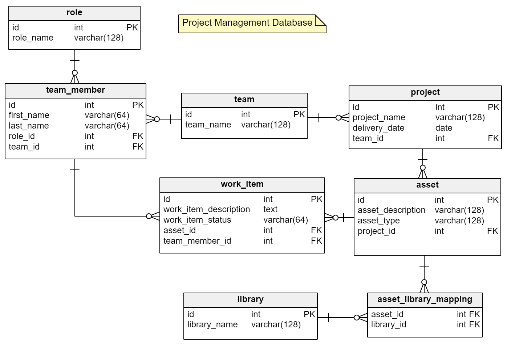

```{r setup and library load, include=FALSE}
# clear console on each execute and set chunk default to not show code
cat('\014')
```

# E-R Diagram

The E-R diagram of the logical data model describing the structure of my database.



# <https://www.tutorialspoint.com/sql/sql-rdbms-concepts.htm>

```{r}
# download and load libraries
if(!require("DBI"))
  install.packages("DBI")
if(!require("dplyr"))
  install.packages("dplyr")
#if(!require("readr"))
#  install.packages("readr")

library(DBI)
library(dplyr)
#library(readr)

# connect (and create) a new local SQLite DB

conn <- dbConnect(RSQLite::SQLite(), "mtcars_db.sqlite")

# add table data to the SQLite db

dbWriteTable(conn, "mtcars", mtcars, overwrite = T, append = F)

# test the DB

#View(mtcars)

# list the tables
dbListTables(conn)
# list the fields in the named table
dbListFields(conn, "mtcars")

# query and store the results

# CRUD - Create, Rename, Update, Delete

# select all data from all columns from table
result <-  dbGetQuery(conn, "SELECT * FROM mtcars")
result

# select data from specific columns from table
result <-  dbGetQuery(conn, "SELECT wt, disp, mpg FROM mtcars")
result

result$wt[0]
# show first 5 results
head(result, 5)
# show last 10 results
tail(result, 10)

result <-  dbGetQuery(conn, "SELECT * FROM mtcars WHERE mpg >= 18 AND mpg <= 22")
result

result <-  dbGetQuery(conn, "SELECT * FROM mtcars WHERE mpg >= 18 AND mpg <= 22 ORDER BY hp ASC LIMIT 4")
result

result <-  dbGetQuery(conn, "SELECT * FROM mtcars WHERE mpg >= 18 AND mpg <= 22 ORDER BY hp DESC LIMIT 4")
result

result <-  dbGetQuery(conn, "SELECT COUNT(mpg) FROM mtcars WHERE mpg > 25")
result

result <-  dbGetQuery(conn, "SELECT AVG(hp) FROM mtcars")
result

# execute a query with no result
dbExecute(conn, "DELETE FROM mtcars WHERE mpg <= 20")

result <-  dbGetQuery(conn, "SELECT * FROM mtcars")
result
```

```{r echo=TRUE}
# use an R chunk to query and store the results
result <- dbGetQuery(conn, "SELECT * FROM mtcars")
result

```

```{sql connection=conn output.var="car_data"}
# use a SQL chunk to query and store the results
SELECT * FROM mtcars

#INSERT INTO mtcars VALUES()

```

```{r}
car_data
```

```{r}
# do not forget to disconnect - otherwise we may hit a remote connection limit
dbDisconnect(conn)
```
